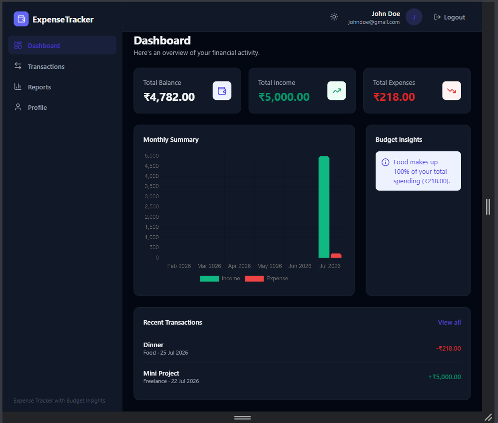
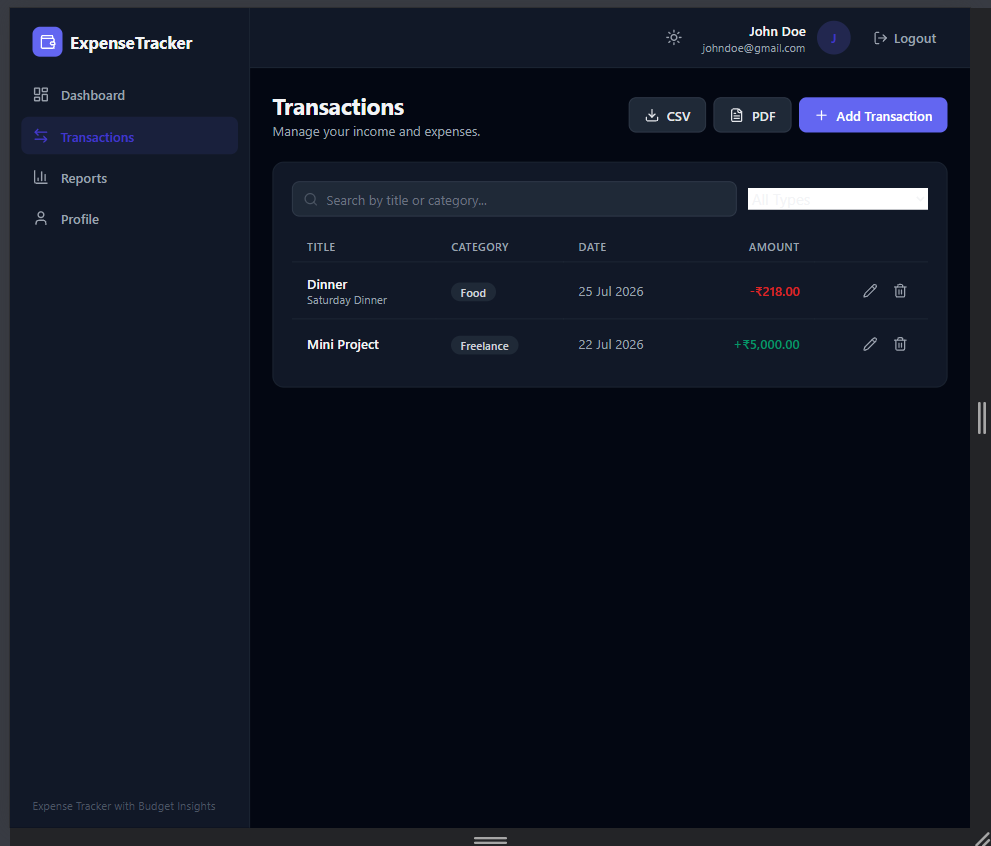
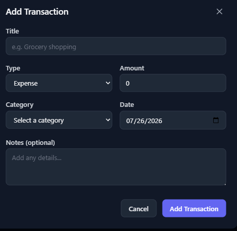
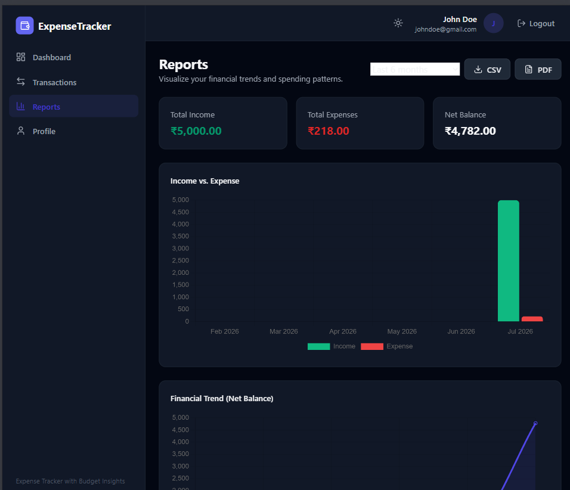
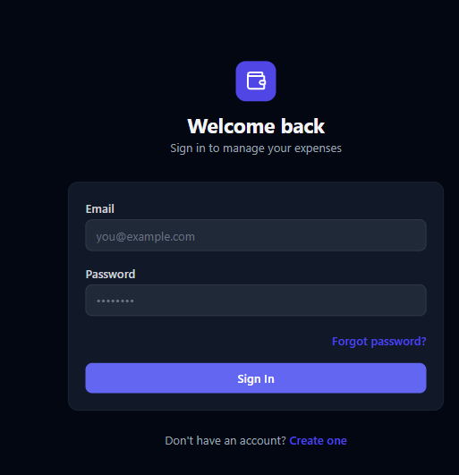
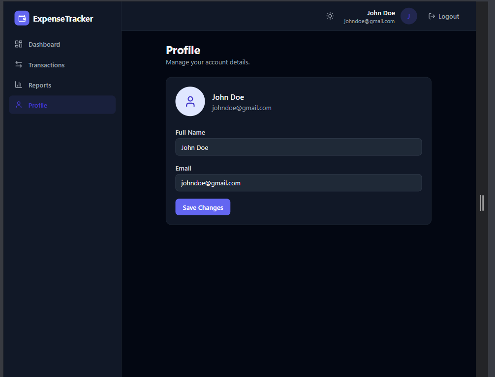
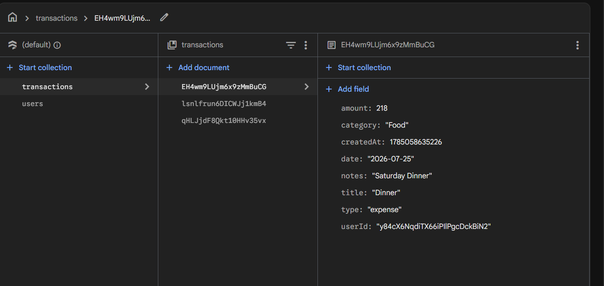

# Expense Tracker with Budget Insights

A modern, responsive personal finance tracker built with **React 19 + TypeScript**, **Vite**, **Firebase** (Authentication + Firestore), **Tailwind CSS**, and **Chart.js**. Track income and expenses in real time, visualize spending patterns, get automatic budget insights, and export your data as CSV or PDF.

---

## Screenshots

| Dashboard | Transactions |
|---|---|
|  |  |

| Add Transaction | Reports |
|---|---|
|  |  |

| Login | Profile |
|---|---|
|  |  |

| Firebase DB |
|---|
|  |

---

## Features

- **Authentication**: email/password login and registration, protected routes, persistent sessions, password reset
- **Dashboard**: total balance, total income, total expenses, monthly income vs. expense chart, automatic budget insights, recent transactions
- **Transactions**: add, edit, delete; search and filter by type; real-time sync via Firestore (`onSnapshot`)
- **Reports**: income vs. expense chart, category distribution pie charts (income and expense), net balance trend line, adjustable date range (3 / 6 / 12 months)
- **Budget Insights**: automatic detection of spending increases, overspending, and category concentration
- **Export**: download transactions as CSV or PDF, from both the Transactions and Reports pages
- **Profile**: update display name, view account email
- **Currency & date formatting**: amounts shown in Indian Rupees (₹), dates shown as `dd/mm/yyyy`
- **Dark mode**: theme toggle with persisted preference
- **Responsive**: works on desktop, tablet, and mobile

---

## Tech Stack

| Layer | Technology |
|---|---|
| Frontend | React 19, TypeScript, Vite |
| Styling | Tailwind CSS |
| Charts | Chart.js + react-chartjs-2 |
| Forms & validation | React Hook Form + Zod |
| Backend / data | Firebase Authentication, Cloud Firestore |
| Export | PapaParse (CSV), jsPDF + jsPDF-AutoTable (PDF) |
| Icons | Lucide React |

---

## Project Structure

```
src/
├── components/
│   ├── charts/          # Chart.js wrapper components
│   ├── layout/           # Navbar, Sidebar, DashboardLayout
│   ├── transactions/      # TransactionForm, TransactionRow
│   └── ui/               # Reusable UI primitives (Button, Input, Modal, etc.)
├── context/              # Auth and Theme React contexts
├── firebase/              # Firebase app/auth initialization
├── hooks/                 # useAuth, useTransactions, useBudgetInsights
├── pages/                 # Route-level pages (Dashboard, Transactions, Reports, ...)
├── routes/                # ProtectedRoute wrapper
├── services/               # Firestore data access, CSV/PDF export, user profile updates
├── types/                  # Shared TypeScript types
└── utils/                  # Formatters, category config, insights calculations
```

---

## Getting Started

### 1. Install dependencies

```bash
npm install
```

### 2. Configure Firebase

Create a Firebase project at [console.firebase.google.com](https://console.firebase.google.com), enable **Email/Password Authentication** and **Cloud Firestore**, then copy `.env.example` to `.env` and fill in your project's config:

```bash
cp .env.example .env
```

### 3. Deploy Firestore rules & indexes

The app queries transactions by `userId` and orders them by `date`, which requires a composite Firestore index. Deploy the rules and index definitions already included in this repo:

```bash
firebase login
firebase deploy --only firestore:rules,firestore:indexes
```

### 4. Run the dev server

```bash
npm run dev
```

The app will be available at `http://localhost:5173`.

### 5. Build for production

```bash
npm run build
```

### 6. Deploy

```bash
firebase deploy --only hosting
```

---

## Firestore Data Model

**`transactions` collection** — one document per transaction:

| Field | Type | Description |
|---|---|---|
| `userId` | string | UID of the owning user |
| `title` | string | Transaction description |
| `amount` | number | Amount (always positive; sign implied by `type`) |
| `type` | `'income' \| 'expense'` | Transaction type |
| `category` | string | Category label |
| `date` | string | ISO date (`yyyy-mm-dd`) |
| `notes` | string (optional) | Free-text notes |
| `createdAt` | number | Timestamp the record was created |

**`users` collection** — one document per user, keyed by UID, storing profile info such as display name.

Security rules restrict read/write access so users can only access their own data (`firestore.rules`).

---

## License

This project is provided as-is for personal or educational use.
